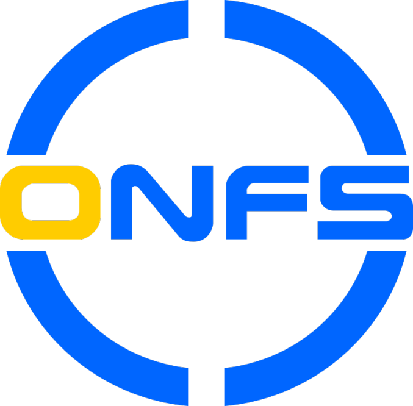
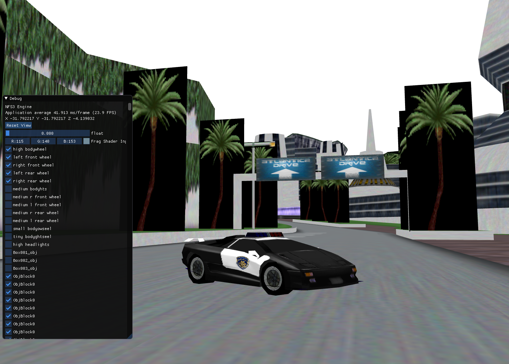

</table>

# OpenNFS 
  
An attempt to recreate the classic Need for Speed Games (1-5), unpacking their original data files into a modern scratch built engine. Early in development, current features include:
 
  * Asset loaders (tracks, cars, images, music etc) for NFS 1-5 PC/PSX 
  * A game engine designed with enough configurability to accurately replicate each titles respective graphics and gameplay
  * Bullet Physics Integration for vehicle dynamics
  * New shaders that allow for dynamic lighting and shadows

  

## Current Loadable Assets

Below is a table better describing the current level of asset load into OpenNFS:

| Game     | Cars  | Tracks | Music |
|----------|-------|------|-------|
| NFS5 PC  | 40%** | 5%** |       |
| NFS4 PC  | 90%*  | 90%* |       |
| NFS4 PS1 | 50%*  |      |       |
| NFS3 PC  | 100%  | 100% | 50%   |
| NFS3 PS1 | 40%   | 90%  | 50%   |
| NFS2 SE  | 90%*  | 90%  |       |
| NFS2 PC  | 90%*  | 90%  |       |
| NFS2 PS1 | 90%*  | 90%  |       |
| NFS1 PC  | 0%    | 0%   |       |

\*Some titles fail to load in current builds of OpenNFS due to the undertaking of a large parser refactor. 

\*\*NFS5 formats are known, but a stable parser has not yet been integrated.
  
## Planned Features

  * An actual implementation of gameplay that replicates the original titles
  * Customisable, modular menus built from configuration files
  * Automated import of game assets from CD, ISO or provided URLs
  * Free Roam of an open world amalgamation of all classic NFS tracks
  * Multiplayer!

## Releases:

OpenNFS does not bundle any EA intellectual property. A copy of the original games must be provided to OpenNFS in order to function, instructions for this are available on the release page.

[View the latest stable feature releases Here](https://github.com/AmrikSadhra/OpenNFS/releases)

### Development builds on CI:

All versions (Windows/Mac/Linux) are built on GitHub Actions. To use these builds, just click on the last build for the main branch and download the version for your operating system there. The Need For Speed games files will still need to be supplied, but otherwise the builds are ready to use. 


|Build Status|
|-----|
|[](https://github.com/OpenNFS/OpenNFS/actions/workflows/build.yml)|

## Keep up to date

#### Github Projects

Check out what I'm working on by looking at the Github Project boards for an upcoming point release [here](https://github.com/OpenNFS/OpenNFS/projects "Github Projects Page").

#### Discord

The project has a dedicated ```#open_nfs``` channel on the "Classic Need for Speed" Discord server, invite [here](https://discord.gg/xndfVZy "Discord Invite").

## Dependencies

The CMake files are currently configured to detect external libraries from within the 'lib' folder at the same level as 'src', just do a 'git submodule update --recursive --remote' to get them.

* GLEW 
* GLFW
* GLM 
* Bullet3
* Freetype2
* Google Test Framework
* g3log

## Thanks

Massive thanks to Rafał Kuźnia, Denis Auroux, Vitaly 'Necromancer', EdasX, Ian Brownm, Jesper Juul-Mortensen and Arushan for their work on reverse engineering various NFS formats and gameplay.
Thanks go out to AJ_Lethal for the OpenNFS Logo.

## Legal:
Models, textures, tracks, cars by EA Seattle (C) 1998, 1999, 2002. EA Canada (C) 2000.
OpenNFS is not affiliated in any way with EA.

Released under the MIT License.

